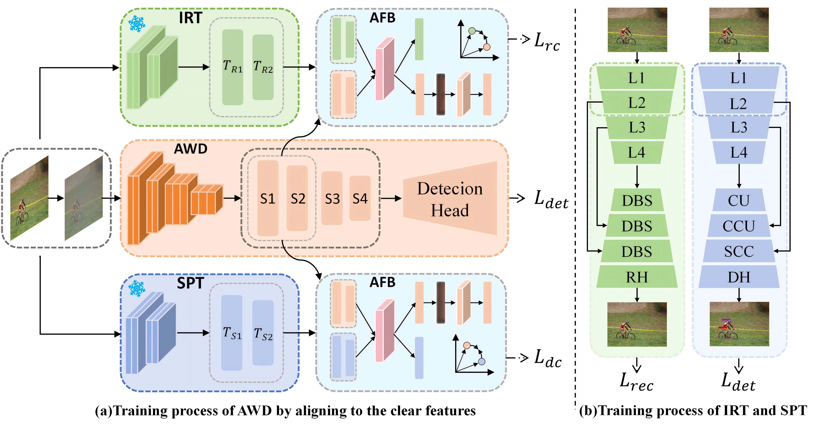

# [Neurocomputing-2026] A lightweight framework for robust object detection in adverse weather based on dual-teacher feature alignment 

Authors: Rui Hu, Hanjun Zheng, Shengjie Ye, [Linbo Qing](https://scholar.google.com.hk/citations?hl=zh-CN&user=0KRDflwAAAAJ), and [Honggang Chen](https://scholar.google.com/citations?user=qkpb0CMAAAAJ)

[[Paper Link]](https://www.sciencedirect.com/science/article/pii/S0925231226001232)

## :bulb: Abstract

> **Abstract:** Object detection in adverse weather conditions (e.g., rain, fog, snow) remains a critical challenge due to degraded image quality and semantic ambiguity. Mainstream approaches attempt to bridge this gap by aligning degraded images with their clear counterparts through two main paradigms: cascading enhancer-detector pipelines and multi-task learning frameworks that jointly optimize restoration and detection objectives. However, these methods often fail to reach their full potential due to the disparity between image restoration and detection tasks. Restoration networks prioritize pixel-level fidelity, while detection networks focus on high-level semantic accuracy, leading to suboptimal performance. In this work, we propose a Dual-Teacher Feature Alignment (DTFA) framework that rethinks the paradigm of “clear image alignment” for adverse weather detection. Instead of directly restoring pixel-level fidelity, we employ clear features as alignment to guide the training of the adverse weather detection student. Specifically, the Invariant Reconstruction Teacher (IRT) from a pre-trained reconstruction network provides weather-invariant priors, and the Semantic Prior Teacher (SPT) from a high-performance detection network offers task-aware semantic information. Two Adaptive Feature Bridging modules dynamically align multi-scale features between the two teachers and the adverse weather detection student, addressing task discrepancies through masked consistency constraints and efficiently enabling the adverse weather detection student to learn complementary information from both the IRT and SPT. During testing, only the adverse weather detection student remains. Therefore, no additional computational costs are incurred. Extensive experiments conducted in rainy, foggy, snowy, and mixed weather conditions demonstrate that our DTFA framework achieves state-of-the-art performance. 
>
> 



<hr />

#### If you find the resource useful, please cite the following :- )

```
@article{HU2026132726,
title = {A lightweight framework for robust object detection in adverse weather based on dual-teacher feature alignment},
journal = {Neurocomputing},
volume = {671},
pages = {132726},
year = {2026},
issn = {0925-2312},
doi = {https://doi.org/10.1016/j.neucom.2026.132726},
url = {https://www.sciencedirect.com/science/article/pii/S0925231226001232},
author = {Rui Hu and Hanjun Zheng and Shengjie Ye and Linbo Qing and Honggang Chen},
}
```

## :rocket: Installation

This model is built in PyTorch 1.10.1 and trained on Ubuntu 20.04 environment (Python 3.8, CUDA 11.7). 

1. Clone our repository

   ```
   git clone https://github.com/huruo1010/DTFA.git
   cd DTFA
   ```
<hr />
## :computer: Usage

### 1. Dataset Preparation
We conduct experiments on various weather conditions, The training and testing datasets are elaborated in the following, you can download the whole dataset [here](https://pan.baidu.com/s/1HDri1s1Wz2D88AxJuiL-Pw?pwd=b614).

- As for clean images for synthesizing the degraded images, the [VOC dataset](http://host.robots.ox.ac.uk/pascal/VOC/voc2012/) is selected, and we name it <u>**VOC-Clean**</u>. It includes 9,578 clean images for training and 2,129 clean images for testing. 

- As for Rain and Snow weather condition, we adopt the rain and snow dataset synthesized by [RDMNet](https://github.com/xfwang23/RDMNet), named **<u>VOC-Rain</u>** and **<u>VOC-Snow</u>** respectively. Both of them contain 9,578 images for training and 2,129 images for testing. 

- As for Fog weather condition, we adopt the fog dataset synthesized by [TogetherNet](https://github.com/yz-wang/TogetherNet) named **<u>VOC-FOG</u>**. 

- As for mixed weather conditions, we synthesized the fog by the code in `utils/syn_fog.py` based on the  **<u>VOC-Rain</u>** and **<u>VOC-Snow</u>** to simulate the conditions of various weather mixtures, gaining **<u>VOC-Rainfog</u>** and **<u>VOC-Snowfog</u>**. 

- As for unified object detection in multiple weather scenes, we combine the above four training sets to form a mixed dataset for model's training, and test its performance on their respective test sets (VOC-Clean-test, VOC-Rain-test, VOC-Haze-test, VOC-Snow-test).

- As for Cross-Domain Generalization Experiments, we adopt the widely used real fog dataset **<u>RTTS</u>** and collect a real rain dataset **<u>RealRain</u>**.
<hr />
### 2. Pre-training SPT and IRT
If you want to pre-train your IRT and SPT teacher, modify `train_annotation_path` and `val_annotation_path` and then run  
```
export PYTHONPATH=$PYTHONPATH:$(pwd)
python train/pretrain_IRT.py
python train/pretrain_SPT.py
```
You can also download the pre-trained weights [here](https://pan.baidu.com/s/12YNdgAKQzqG8vzGBe0xyxQ?pwd=b614)
<hr />
### 3. Training AWD
Modify the pre-trained weights path  `model_path`, `SPT_model_path`, `IRT_model_path`, and annotation paths, and then run
```
python train/train_AWD.py
```
<hr />
### 4. Testing
Modify the `model_path` to your pretrained weights path in `yolo.py` and fill in the path of your test sets in `gep_map.py`, then run `get_map.py` by

```
python get_map.py 
```


## :e-mail: Contact
Should you have any question, please create an issue on this repository or contact at xfwang23@foxmail.com and  liuxmail1220@gmail.com.

<hr />

## :heart: Acknowledgement
We thank [TogetherNet](https://github.com/yz-wang/TogetherNet) and [YOLOXs](https://github.com/Megvii-BaseDetection/YOLOX) for their excellent baseline to promote the development of our work.

<hr />

## :heart: Acknowledgement
We thank [TogetherNet](https://github.com/yz-wang/TogetherNet), [YOLOXs](https://github.com/Megvii-BaseDetection/YOLOX), and [RDMNet](https://github.com/xfwang23/RDMNet) for their excellent baseline to promote the development of our work.


## Contact

If you have questions, you can contact `hu_rui@stu.scu.edu.cn`.

## :pray: Citation
If this work is helpful for you, please consider citing:
```
@article{HU2026132726,
title = {A lightweight framework for robust object detection in adverse weather based on dual-teacher feature alignment},
journal = {Neurocomputing},
volume = {671},
pages = {132726},
year = {2026},
issn = {0925-2312},
doi = {https://doi.org/10.1016/j.neucom.2026.132726},
url = {https://www.sciencedirect.com/science/article/pii/S0925231226001232},
author = {Rui Hu and Hanjun Zheng and Shengjie Ye and Linbo Qing and Honggang Chen},
}
```
